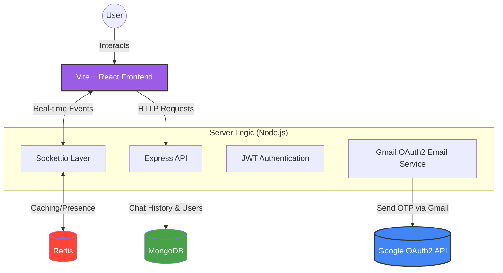

<p align="center">
  
  
</p>

<p align="center">
  Discord-style chat app • Vite + Tailwind • Express + MongoDB • Socket.IO
</p>

<p align="center">
  <a href="https://youtu.be/jZi9OCY6gsk">Watch the demo video</a>
</p>

<p align="center">
  
  
  
  
  
</p>

## What is this?

PiperChat is a Discord-style chat app with:

- Direct Messages + Servers/Channels
- Realtime updates via Socket.IO
- Presence + unread counts
- Email OTP verification
- Profile updates (display name + avatar) with Supabase storage
- Optional Redis caching (Upstash supported)

---

# Project Structure

- `server/` → Express + MongoDB + Socket.IO API (ESM)
- `frontend/` → Vite + Tailwind UI

---

# System Architecture



---

# Quick Start

## 1) Install Dependencies

```bash
cd server && npm install
cd ../frontend && npm install
```

---

## 2) Environment Variables

- Copy `PiperChat01/.env.example` → `PiperChat01/.env`
- Copy `PiperChat01/frontend/.env.example` → `PiperChat01/frontend/.env`

---

## 3) Run the Applications

### Backend

```bash
cd server
npm start
```

### Frontend

```bash
cd frontend
npm run dev
```

Frontend runs on:

```txt
http://localhost:5173
```

Backend runs on:

```txt
http://localhost:2000
```

---

# Environment Variables

## Server (`PiperChat01/.env`)

| Key                                                              | Required | Notes                                  |
| ---------------------------------------------------------------- | -------: | -------------------------------------- |
| `MONGO_URI`                                                      |       ✅ | MongoDB connection string              |
| `ACCESS_TOKEN`                                                   |       ✅ | JWT secret                             |
| `PORT`                                                           |       ❌ | Default `2000`                         |
| `default_profile_pic`                                            |       ✅ | Used on signup                         |
| `MAIL_USER` / `MAIL_PASS`                                        |       ✅ | Gmail App Password flow                |
| `OAUTH_CLIENTID` / `OAUTH_CLIENT_SECRET` / `OAUTH_REFRESH_TOKEN` |       ❌ | Optional OAuth2 email sending          |
| `REDIS_URL`                                                      |       ❌ | Upstash URL supported (`rediss://...`) |
| `REDIS_CACHE_TTL_SECONDS`                                        |       ❌ | Default `30`                           |

---

## Frontend (`PiperChat01/frontend/.env`)

| Key                           | Required | Notes                                  |
| ----------------------------- | -------: | -------------------------------------- |
| `REACT_APP_URL`               |       ✅ | Backend URL (`http://localhost:2000`)  |
| `REACT_APP_front_end_url`     |       ✅ | Frontend URL (`http://localhost:5173`) |
| `REACT_APP_SUPABASE_URL`      |       ❌ | For avatar uploads                     |
| `REACT_APP_SUPABASE_ANON_KEY` |       ❌ | For avatar uploads                     |
| `REACT_APP_SUPABASE_BUCKET`   |       ❌ | For avatar uploads                     |

---

# Scripts

## Server

```bash
npm start
npm test
```

### Available Commands

| Command | Description |
| --- | --- |
| `npm start` | Runs backend using nodemon |
| `npm test` | Runs backend integration tests |

---

## Frontend

```bash
npm run dev
npm run build
npm run lint
```

---

# Backend Testing

The backend now includes integration testing support using:

- Vitest
- Supertest
- MongoMemoryServer

---

## Running Backend Tests

```bash
cd server
npm install
npm test
```

---

## Testing Features

### Current Integration Coverage

- Authentication signup flow
- OTP verification flow
- Signin flow
- Friend request send flow
- Friend request accept flow
- Friend request ignore flow

---

## Testing Architecture

### Isolated Database

Tests run using:

```txt
MongoMemoryServer
```

This means:

- No production MongoDB Atlas database is used
- No external database credentials are required
- Each test suite runs in isolation
- Database state is automatically cleaned after tests

---

### Mocked External Services

External email services are mocked during tests.

This ensures:

- No real emails are sent
- Faster test execution
- Deterministic OTP verification
- Stable CI/CD behavior

---

## Test Structure

```txt
server/tests/
├── auth.test.js
├── friend.test.js
├── mocks.js
└── setup.js
```

---

# CI Checks

This repository uses GitHub Actions to run automated checks on every pull request and push to `main`.

Current CI checks include:

- Frontend dependency install with `npm ci`
- Frontend linting with `npm run lint`
- Frontend production build with `npm run build`
- Backend dependency install with `npm ci`

Future backend CI can additionally run:

```bash
cd server
npm test
```

to validate integration test coverage automatically.

---

# Local CI Validation

## Frontend

```bash
cd frontend
npm ci
npm run lint
npm run build
```

---

## Backend

```bash
cd server
npm ci
npm test
```