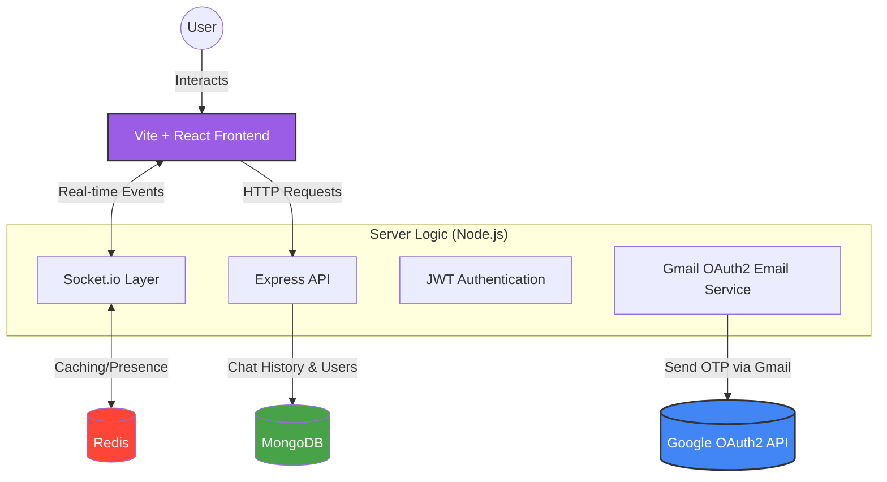

<p align="center">
  
  
</p>

<p align="center">
  Discord-style chat app • Vite + Tailwind • Express + MongoDB • Socket.IO
</p>

<p align="center">
  <a href="https://youtu.be/jZi9OCY6gsk">Watch the demo video</a>
</p>

<p align="center">
  
  
  
  
  
</p>

## What is this?

PiperChat is a Discord-style chat app with:

- Direct Messages + Servers/Channels
- Realtime updates via Socket.IO
- Presence + unread counts
- Email OTP verification 
- Profile updates (display name + avatar) with Supabase storage
- Optional Redis caching (Upstash supported)

## Project structure

- `server/` → Express + MongoDB + Socket.IO API (ESM)
- `frontend/` → Vite + Tailwind UI

## System Architecture

To help contributors understand the data flow, here is the technical visualization of how PiperChat components interact:



## Quick start

### 1) Install dependencies

```bash
cd server && npm install
cd ../frontend && npm install
```

### 2) Environment variables

- Copy `PiperChat01/.env.example` → `/PiperChat01/.env`
- Copy `PiperChat01/frontend/.env.example` → `PiperChat01/frontend/.env`

### 3) Run the apps

```bash
cd server && npm start
```

```bash
cd frontend && npm run dev
```

Frontend runs on `http://localhost:5173`  
Server runs on `http://localhost:2000`

## Environment variables

### Server (`PiperChat01/.env`)

| Key                                                              | Required | Notes                                  |
| ---------------------------------------------------------------- | -------: | -------------------------------------- |
| `MONGO_URI`                                                      |       ✅ | MongoDB connection string              |
| `ACCESS_TOKEN`                                                   |       ✅ | JWT secret                             |
| `PORT`                                                           |       ❌ | Default `2000`                         |
| `default_profile_pic`                                            |       ✅ | Used on signup                         |
| `MAIL_USER` / `MAIL_PASS`                                        |       ✅ | Gmail App Password flow                |
| `OAUTH_CLIENTID` / `OAUTH_CLIENT_SECRET` / `OAUTH_REFRESH_TOKEN` |       ❌ | Optional OAuth2 email sending          |
| `REDIS_URL`                                                      |       ❌ | Upstash URL supported (`rediss://...`) |
| `REDIS_CACHE_TTL_SECONDS`                                        |       ❌ | Default `30`                           |

### Frontend (`PiperChat01/frontend/.env`)

| Key                           | Required | Notes                                  |
| ----------------------------- | -------: | -------------------------------------- |
| `REACT_APP_URL`               |       ✅ | Backend URL (`http://localhost:2000`)  |
| `REACT_APP_front_end_url`     |       ✅ | Frontend URL (`http://localhost:5173`) |
| `REACT_APP_SUPABASE_URL`      |       ❌ | For avatar uploads                     |
| `REACT_APP_SUPABASE_ANON_KEY` |       ❌ | For avatar uploads                     |
| `REACT_APP_SUPABASE_BUCKET`   |       ❌ | For avatar uploads                     |

## Scripts

### Server

- `npm start` → runs with nodemon

### Frontend

- `npm run dev` → Vite dev server
- `npm run build` → production build
- `npm run lint` → ESLint

## CI checks

This repository uses GitHub Actions to run automated checks on every pull
request and every push to `main`.

The workflow lives at `.github/workflows/ci.yml` and currently runs:

- Frontend dependency install with `npm ci`
- Frontend linting with `npm run lint`
- Frontend production build with `npm run build`
- Backend dependency install with `npm ci`

These checks help contributors catch broken builds, lint errors, and dependency
issues before maintainers review the pull request.

To run the same checks locally:

```bash
cd frontend
npm ci
npm run lint
npm run build
```

```bash
cd server
npm ci
```

Backend tests are not included yet because the backend does not currently have a
test script. Once backend tests are added, the CI workflow can be extended to run
`npm test` inside `server/`.
